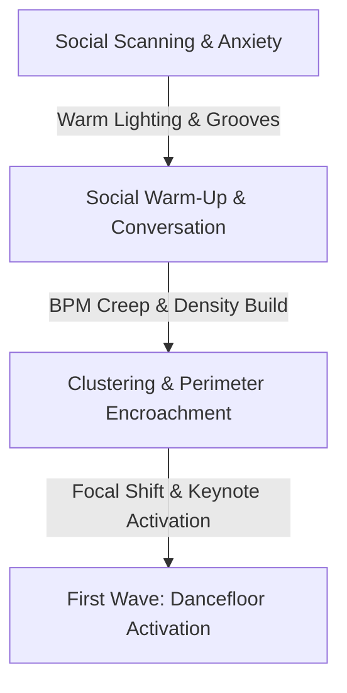
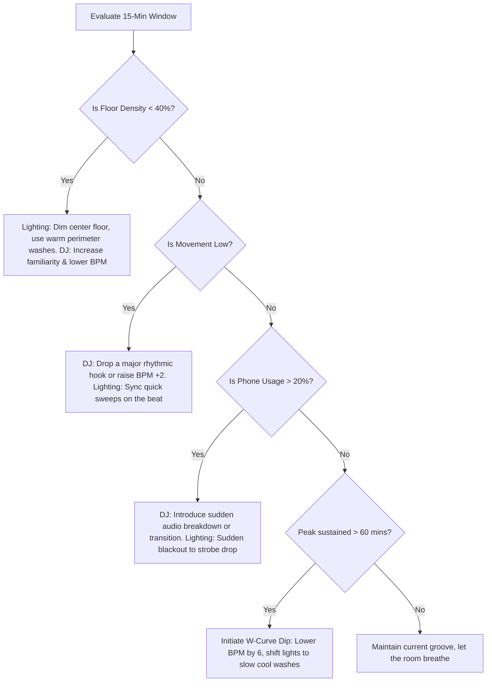

# Crowd Dynamics and Show Engineering: A Master Guide to Session Pacing and Crowd Energy

This research document is designed for show engineers, event directors, and resident DJs. It provides a scientific, data-driven framework for managing crowd energy, dwell time, and behavioral outcomes over the course of a full performance session—from doors-open to close.

---

## 1. The Arrival Phase (0–45 min): Setting the Social Contract

The first 45 minutes of a session are the most fragile. During this phase, attendees transition from isolated individuals in the outside world into a collective social body. 

### Psychological State of Early Arrivals
*   **Social Scanning & Hyper-Awareness:** Early arrivals experience heightened self-consciousness. Because the venue lacks density, individuals feel "on display." They scan the environment to locate physical anchors (bars, restrooms, stage, exits) and evaluate early social norms (what people are wearing, how they are behaving).
*   **Behavioral Hesitancy:** In the absence of a dense crowd, the "bystander effect" is high. People are highly reluctant to dance or stand in open spaces, choosing instead to stick to perimeter walls, seating, or bar areas.
*   **The Ingress Transition:** The transition from the street to the venue is a sensory shock. Early arrivals need a psychological "de-escalation" zone to shed outside stress before they can begin climbing the energy ladder.

### Music Strategy for Arrival
The music during this phase must act as an acoustic buffer that lowers social anxiety and facilitates conversation.
*   **Tempo (BPM):** Keep tempo between **90–115 BPM**.
*   **Energy Level:** Low-to-moderate. Focus on deep grooves, organic house, downtempo, lo-fi, warm neo-soul, or ambient electronica. Avoid aggressive synths, heavy builds, or dominant kick drums.
*   **Familiarity:** Mid-to-high familiarity but presented in relaxed, non-obtrusive formats (e.g., acoustic covers, chilled remixes, or recognizable basslines played at lower tempos). This provides instant comfort without demanding active attention.

### Defining the Social Contract (First 15 Minutes)
The first 15 minutes define the night’s personality and establish emergent norms:
*   **Auditory Volume Ceiling:** Set the sound level so it masks conversational silence but allows people to talk comfortably without shouting. Shouting too early causes vocal fatigue and increases social stress.
*   **Genre and Attitude:** The music must signal the event's "taste profile." Playing sophisticated, warm grooves early signals a curated, high-end experience, whereas playing generic radio hits signals a commercial, low-barrier environment.

### Lighting Dynamics in the Arrival Phase
The goal of lighting here is to minimize self-consciousness by creating safety and warmth.
*   **Warm Color Palette:** Use amber, warm gold, soft orange, and dim candlelight tones. These colors flatter skin tones, reduce anxiety, and evoke cozy, safe environments.
*   **Angles and Diffusion:** Rely on indirect, diffused, and low-angle lighting (e.g., uplighting, wall washes, architectural accents). Keep the main dancefloor dark or covered in a low-intensity, static wash. 
*   **Avoid:** Harsh overhead white lighting (which triggers self-consciousness) and rapid movement or strobing (which feels aggressive and premature).

---

## 2. The Build Phase (45 min – 2 hours in): Activating the Room

Once the venue reaches a critical threshold of density, the environment must shift from a passive social space to an active, collective experience.



### Progressive Energy Escalation
To raise energy without peaking too early, show engineers use two primary levers:
1.  **BPM Creep:** A subtle technique where the DJ increases the tempo by **1–2 BPM every 10–15 minutes**. The human ear does not perceive these micro-adjustments, but the cardiovascular system responds to the faster tempo, raising the crowd's heart rate.
2.  **Rhythmic Density:** Gradually introduce track elements with higher energy profiles—adding sharper hi-hats, more prominent basslines, and increasing percussion density while transitioning from organic textures to more synthetic, energetic sounds.

### The Social Warm-Up
Before a crowd dances, they socialize. Group formation follows a highly predictable pattern:
*   **Pod Clustering:** People cluster in tight social units (2–4 people) facing inward, using cups or drinks as physical anchors.
*   **Perimeter Encroachment:** As density increases, these pods shift from seating areas toward the edges of the dancefloor.
*   **Physical Synchronization:** As the music builds, members of these pods begin to micro-synchronize—nodding heads, tapping feet, and swaying in time, while still maintaining conversation.

### Triggering the First Wave (Dancefloor Activation)
The transition from standing to dancing is triggered by a combination of social proof and show engineering:
*   **The "Keynotes" (Social Instigators):** The first few individuals (often highly expressive, extroverted, or slightly intoxicated) who step onto the floor. Their action lowers the social risk for others.
*   **The Focal Shift:** The show engineer changes the lighting to focus on the dancefloor. Moving heads begin to sweep gently across the room, and the center of the dancefloor becomes slightly brighter, inviting entry.
*   **The Groove Drop:** The DJ drops a highly recognizable, rhythmically compelling track with an infectious bassline (often around 120–122 BPM). The volume is bumped up by **2–3 dB**—just enough to make conversation secondary to physical movement.

### Pacing Mistakes to Avoid
*   **Premature Peak:** Dropping high-energy anthems or peak-hour tracks during the build phase. This exhausts the early crowd and causes a rapid drop-off in energy before late arrivals even enter the room.
*   **The Flatline (Under-Pacing):** Keeping the energy level static for too long. If the crowd does not feel a clear progression, they become bored, dwell times drop, and they migrate to the exits or other venues.

---

## 3. The Peak Phase: Sustaining the High

The peak phase is the climax of the session, where individual identities merge into a unified, high-density collective.

### Neurological State of a Peak Crowd
*   **Dopamine & Anticipation:** The brain's reward center (*nucleus accumbens*) is flooded with dopamine, specifically triggered by the tension-and-release cycles (build-ups and "drops") of the performance.
*   **Endorphin Surge:** Physical exertion from dancing triggers endorphin release, masking physical fatigue and creating a natural euphoric high.
*   **Collective Effervescence:** A sociological state where individuals experience a shared emotional synchrony. People feel highly connected to strangers, mirroring movements and expressions.
*   **Deindividuation:** The reduction of self-awareness. The crowd acts as a single organism, responding to sensory inputs instantly and collectively.

### Peak Sustainability & Fatigue Curves
*   **The 45–75 Minute Limit:** Human physiology and neurology cannot maintain a true peak indefinitely. Research on physical stamina, auditory fatigue, and sensory habituation indicates that a genuine peak state can only be sustained for **45 to 75 minutes** (maximum 90 minutes for highly athletic crowds).
*   **Dopamine Downregulation:** Under sustained, high-intensity stimulation, the brain downregulates dopamine receptors to protect itself from overstimulation. The music begins to feel "flat" or "noisy" rather than exciting.
*   **Auditory Fatigue (Temporary Threshold Shift):** Prolonged exposure to high sound pressure levels (especially above 100 dBA) causes the inner ear's hair cells to become less sensitive, reducing the perceived clarity and punch of the sound.

### Peak Management: Dynamic Variations
To sustain the peak for as long as possible, the show engineer must build in micro-recovery periods:
*   **Micro-Dips (Breakdowns):** Periodically strip the drums and low frequencies out of the mix (e.g., a 16-to-32 bar breakdown containing only melodies, vocals, or ambient synths). This allows the crowd's heart rates to drop slightly and resets dopamine anticipation for the next drop.
*   **Visual Contrasts:** Do not run strobes and high-speed moving lights continuously. Use moments of near-darkness or static, single-color washes (e.g., deep blue or red) during breakdowns. When the drop occurs, reintroducing rapid movement and flashes will have double the impact.

### Signs the Peak is Ending
*   **Heavy Feet:** Crowd movement shifts from high-energy jumping and arm-waving to heavier, slower swaying.
*   **Phone Resurgence:** Attendees begin pulling out their phones to check messages or take photos, indicating their attention is drifting.
*   **Floor Thinning:** The core of the dancefloor thins out as people seek fresh air, hydration, or migrate toward the bar and restrooms.

---

## 4. The Post-Peak and Wind-Down: Securing Return Intent

How a session ends determines how it is remembered. Event organizers often neglect the wind-down, resulting in a sudden, jarring exit that damages the overall experience.

### The Peak-End Rule
Originally coined by psychologist Daniel Kahneman, the **Peak-End Rule** states that humans evaluate an experience based primarily on two points: its **highest peak of emotional intensity** and its **ending**. 

> [!IMPORTANT]
> The duration of the event is largely ignored by memory. A 5-hour event with a spectacular peak and a warm, emotional closing will be remembered far more fondly than a consistently good event that ends with a sudden cut-off and bright white house lights.

### The Emotional Function of the Wind-Down
The wind-down serves to transition the nervous system from a sympathetic state (high arousal, adrenaline, fight-or-flight) to a parasympathetic state (calm, recovery, rest-and-digest).
*   **Memory Consolidation:** A gradual wind-down allows the brain to process the intense sensory inputs of the night, converting the immediate experience into long-term positive memories.
*   **Loyalty and Return Intent:** Ending on a warm, emotionally resonant note builds a sense of closure and nostalgia, making attendees far more likely to buy tickets for future events.

### Music & Lighting for the Closing Phase
*   **Tempo & Arrangements:** Gradually reduce the BPM back to the **115–120 range**. Use tracks with rich melodies, vocals, and warm basslines. Eliminate aggressive synths and heavy, repetitive percussion loops.
*   **The Emotional Anchor (The Last 10 Minutes):** Play highly nostalgic, emotional, or anthemic tracks. Sing-alongs or classic tracks are highly effective here because they trigger shared vocal participation, uniting the room one last time.
*   **House Lights Graduation:** Never turn the bright white house lights on instantly. This is a sensory shock that triggers irritation. Instead, gradually fade up warm, golden, or amber washes over a 10-to-15 minute period. The lighting should gently reveal the space, guiding the crowd to the exits while maintaining a warm, magical atmosphere.

---

## 5. The W-Curve and Intentional Energy Dips

To extend a performance session beyond two hours without exhausting the crowd, show engineers must reject the linear "staircase" energy model in favor of the **W-Curve**.

```
Energy Level
  ^
  |        Peak 1 (124 BPM)                     Peak 2 (126-128 BPM)
  |           /\                                   /\
  |          /  \                                 /  \
  |         /    \        Deliberate Dip         /    \
  |        /      \         (118 BPM)           /      \
  |  Build/        \________/``````\___________/        \  Wind-Down
  |  /                                                   \   /
  | /                                                     \_/
  +------------------------------------------------------------> Time
```

### Why Sustained High Energy Fails
Sustained high energy creates a state of **sensory habituation** and **lactic acid accumulation**. Without recovery, the crowd reaches a physical and cognitive breaking point, leading to early departures (dwell time collapse). 

### Engineering a Deliberate Dip
An intentional dip is a planned, 15-to-20 minute window where the show engineer pulls the room back to allow physical and neurological recovery.
*   **Tempo Shift:** Drop the BPM by **5–8 beats**.
*   **Arrangement Strip-back:** Transition to tracks that rely on deep, rolling basslines, atmospheric textures, and minimal percussion. Remove bright, aggressive leads.
*   **Visual Reset:** Switch the lighting to slow, sweeping movements or static, cool-colored washes (e.g., deep cyan, violet, or forest green). Keep strobes entirely off.

### Recovery Window Duration
*   **The Sweet Spot (12–18 minutes / 3–4 tracks):** This duration is long enough for the body to clear some lactic acid, for the ears to recover from temporary threshold shifts, and for the brain to replenish dopamine stores. It is short enough to prevent the crowd from disengaging entirely.

### Avoiding "Losing the Room"
Dipping too deep or for too long can kill the event's momentum, causing people to leave. To prevent this:
*   **Maintain the Rhythmic Hook:** Keep a strong, infectious low-end groove. Even if the energy is low, the body must still feel a physical invitation to sway.
*   **Keep Volume Warm:** Do not drop the sound level too low. Keep it physically present, but shift the focus from high-frequency energy (harsh hats, loud vocals) to warm low-frequency energy (sub-bass).
*   **Visual Intrigue:** Use subtle, slow-tempo lighting sequences that are visually mesmerizing (e.g., slow organic textures or laser fans moving at a crawl) to keep eyes focused on the stage.

---

## 6. Interval-Based Show Engineering: The 15-Minute Model

Show engineering is not static; it requires real-time monitoring and adjustment. The **15-Minute Model** is a structured observation-and-action framework used to guide the energy of a room.

### Observational Data Points
Every 15 minutes, the show engineer and DJ assess five key metrics:

| Metric | Assessment Criteria |
| :--- | :--- |
| **Density (D)** | What percentage of the dancefloor is full? Is the crowd concentrated at the front, center, or perimeter? |
| **Movement (M)** | What is the level of physical exertion? (Static standing, head nodding, hip swaying, hands in air, jumping). |
| **Gaze (G)** | Where are eyes focused? (Stage/DJ, social partners, room scanning, phone screens). |
| **Interaction (I)** | Are people dancing together/facing each other, or standing in isolated, inward-looking circles? |
| **Bar/Exits (B)** | Is the flow direction moving toward the bar/exits (exhaustion/boredom) or toward the dancefloor (activation)? |

### Decision Rules and Interventions
Based on the 15-minute assessment, the crew applies the following rules:



### The Role of Session History
Real-time decisions must be informed by the history of the session. 
*   **Contrast Principle:** An intervention's impact is determined by what came before it. A high-energy track will fall flat if the preceding 15 minutes were also high-energy. It will explode if preceded by a deep, dark, low-energy build-up.
*   **Energy Budgeting:** Keep track of how many "peaks" you have used. A standard crowd has a budget of **2 to 3 major peaks** per night. If you use them all up in the first 2 hours, the remaining session will suffer from terminal fatigue.

---

## 7. Time-of-Night Prescriptions

Here are detailed, step-by-step templates for 3-hour, 5-hour, and late-night sessions.

### Arc Template 1: The 3-Hour Session (180 mins)
*Typically used for corporate events, private shows, or short concert slots.*

```
Energy
  ^
10|                                  Peak (124-126 BPM)
  |                                     /`````\
  |                       Build        /       \  Wind-down
  |                      /`````\      /         \___
  |          Arrival    /       \____/              \
  |       __/````````\_/
  +--------------------------------------------------------> Time (Mins)
  0        45         90        120         150      180
```

*   **Phase 1: Ingress & Warm-up (0–45 min)**
    *   **BPM:** 100 $\rightarrow$ 110 BPM.
    *   **Energy Level:** 3/10.
    *   **Lighting:** Static amber uplighting, soft architectural washes. Dancefloor is dark.
*   **Phase 2: The Fast Build (45–90 min)**
    *   **BPM:** 110 $\rightarrow$ 120 BPM.
    *   **Energy Level:** 6/10.
    *   **Lighting:** Introduction of slow-moving gobo patterns, cool blue/magenta accents.
    *   **Intervention Window (60 min mark):** Drop the first highly recognizable vocal track to pull the social crowd onto the floor.
*   **Phase 3: The Mini-Dip (90–105 min)**
    *   **BPM:** Step down to 116 BPM.
    *   **Energy Level:** 4/10.
    *   **Lighting:** Solid slow-fading washes, no moving beams.
*   **Phase 4: The Peak (105–150 min)**
    *   **BPM:** 122 $\rightarrow$ 126 BPM.
    *   **Energy Level:** 9/10.
    *   **Lighting:** Full range of movement, strobes on drops, intense warm colors (reds, yellows, whites).
*   **Phase 5: Wind-Down & Egress (150–180 min)**
    *   **BPM:** 120 $\rightarrow$ 112 BPM.
    *   **Energy Level:** 4/10.
    *   **Lighting:** Warm, slow transitions. House lights start rising gradually at the 170-minute mark.

---

### Arc Template 2: The 5-Hour Session (300 mins)
*The standard nightclub or long concert format (e.g., 9:00 PM – 2:00 AM).*

| Time | Phase | Target BPM | Energy (1-10) | Lighting Concept |
| :--- | :--- | :--- | :--- | :--- |
| **09:00 - 09:45** | Arrival & Ingress | 95–108 | 2–3 | Static warm amber/gold, dim, safe, comfortable. |
| **09:45 - 10:45** | The Social Build | 108–118 | 4–5 | Low-intensity moving washes, deep blue & purple base. |
| **10:45 - 11:30** | Dancefloor Activation | 118–122 | 6–7 | Moving heads sweep dancefloor, synchronized color pulses. |
| **11:30 - 12:30** | **Peak Phase 1** | 122–125 | 8–9 | Full beam movement, white strobe highlights, warm high-energy colors. |
| **12:30 - 01:00** | **The W-Curve Dip** | 118–120 | 5 | Deep cyan/purple slow washes. Beams static, pointing up. |
| **01:00 - 01:45** | **Peak Phase 2** | 125–128 | 10 | Maximum intensity, strobes, laser fans, saturated reds/pinks. |
| **01:45 - 02:00** | Wind-Down | 118–110 | 3 | Slow fade to warm amber. House lights rise gradually from 01:50. |

*   **Key Intervention Window (11:30 PM):** The "Midnight Pivot." This is when late arrivals have fully entered and early arrivals are ready to dance. Shift the music to high-energy hooks and elevate the sound system volume by 2 dB.
*   **Key Intervention Window (01:00 AM):** The "Second Wind." Following the W-curve recovery dip, drop the biggest track of the night to launch Peak Phase 2.

---

### Arc Template 3: The Late-Night Session (10pm–3am)
*Typically used for electronic music events, afterparties, or late club slots.*

*   **10:00 PM - 11:00 PM: Orientation & Low Groove**
    *   **BPM:** 112 $\rightarrow$ 118 BPM.
    *   **Energy Level:** 4/10.
    *   **Lighting:** Dim, dark base. Deep purple and indigo tones. Minimal front lighting on stage.
*   **11:00 PM - 12:15 AM: Deep Build**
    *   **BPM:** 118 $\rightarrow$ 123 BPM.
    *   **Energy Level:** 6/10.
    *   **Lighting:** Scanning beams, slow laser projections, cool green and blue color palette.
*   **12:15 AM - 01:15 AM: Peak Phase 1**
    *   **BPM:** 123 $\rightarrow$ 126 BPM.
    *   **Energy Level:** 8/10.
    *   **Lighting:** Fast moving beams, high-contrast strobing, warm orange/amber highlights.
*   **01:15 AM - 01:45 AM: Deep Recovery (W-Curve Dip)**
    *   **BPM:** Step down to 120 BPM.
    *   **Energy Level:** 5/10.
    *   **Music:** Hypnotic, progressive, long melodic builds. Stripped percussion.
    *   **Lighting:** Monochrome blue/violet wash, lasers set to slow, horizontal ceiling sheets.
*   **01:45 AM - 02:45 AM: Peak Phase 2 (The Climax)**
    *   **BPM:** 126 $\rightarrow$ 130 BPM.
    *   **Energy Level:** 10/10.
    *   **Lighting:** Maximum speed, strobe blinders on drops, red/white/magenta saturated colors.
*   **02:45 AM - 03:00 AM: Melodic Decompression**
    *   **BPM:** 122 $\rightarrow$ 115 BPM.
    *   **Energy Level:** 3/10.
    *   **Lighting:** Slow fade down of moving effects. Warm amber side-lighting. House lights slowly fade up over 15 minutes.
