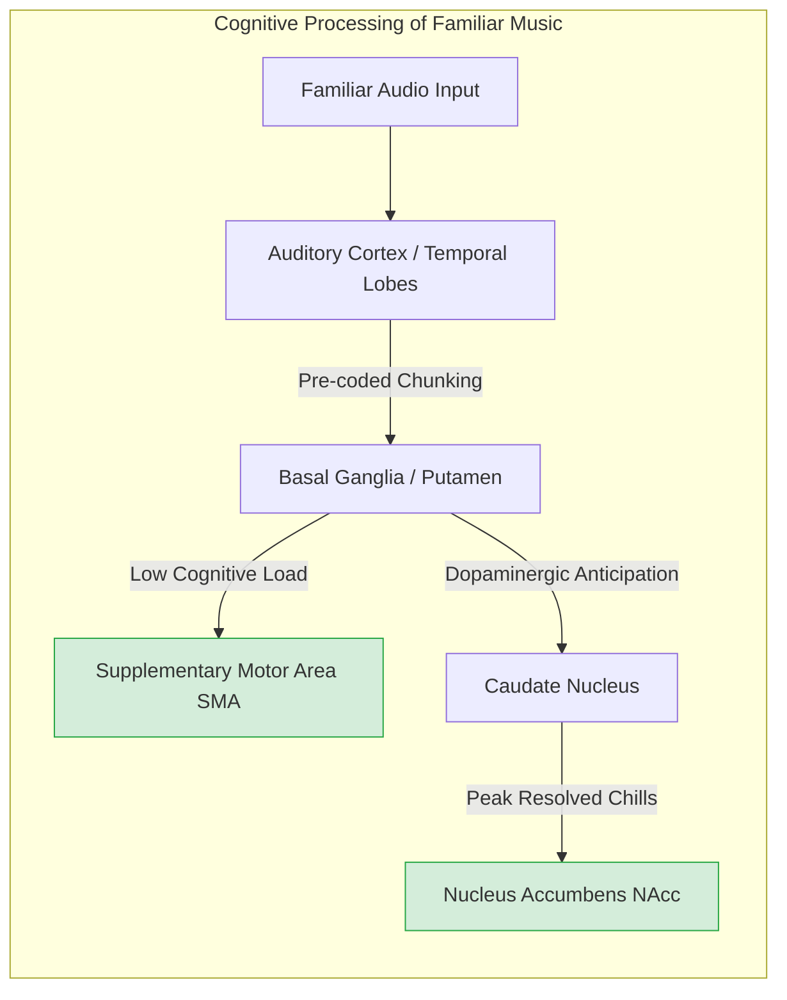
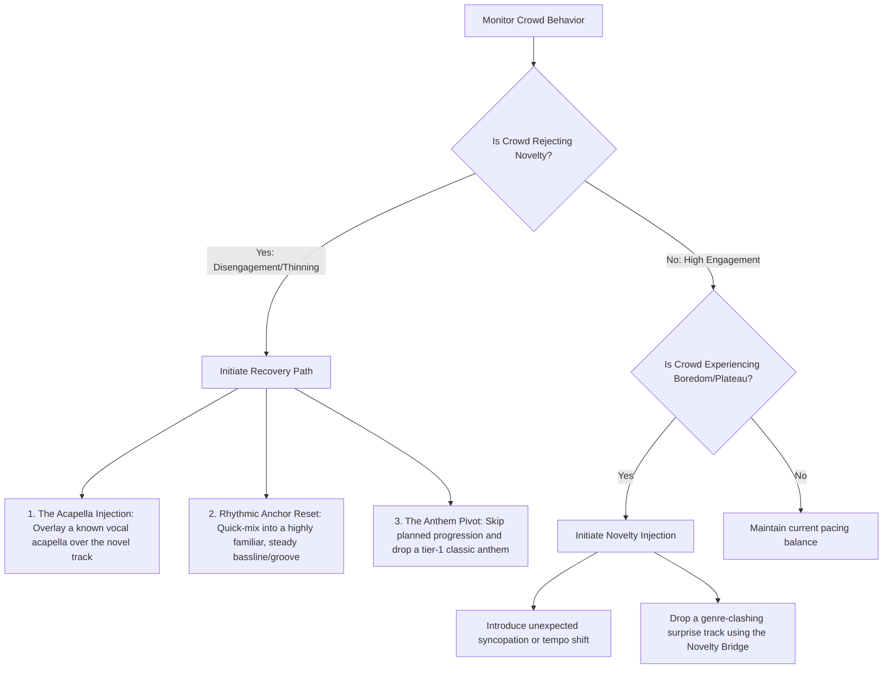

# The Familiarity-Novelty Axis in Show Engineering: Neuroscience, Behavior, and Real-Time Crowd Pacing

This document provides a scientific framework for understanding how musical familiarity and novelty affect the human brain, crowd coordination, and dancefloor behavior. It translates cognitive neuroscience into real-time operational guidelines for show engineers and music programmers.

---

## 1. The Neuroscience of Familiarity: Cognitive Ease and Reward

Familiarity in music is not merely a preference; it is a neurological state that radically alters how the brain processes sound, allocates attention, and coordinates motor action.



### Reward Circuit Dissociation (Anticipation vs. Consumption)
Research led by Valorie Salimpoor using fMRI and PET imaging reveals a functional dissociation in the striatum when listening to familiar, pleasurable music:
*   **The Anticipation Phase (Caudate Nucleus):** As a familiar song progresses toward a known transition or "drop," the caudate nucleus is activated. This region is involved in prediction, learning, and the anticipation of reward. Dopamine is released here as the brain anticipates the emotional peak.
*   **The Consumption Phase (Nucleus Accumbens - NAcc):** At the exact moment of the musical peak (e.g., the drop, a vocal entry, or a chord resolution), dopamine release shifts to the nucleus accumbens. The NAcc is the core pleasure center of the brain, responsible for the experience of euphoria, physical "chills" (frisson), and reward consumption.

### The Mechanism of "Chills" (Frisson)
Musical chills—characterized by goosebumps, shivering, and transient autonomic nervous system arousal (increased heart rate and skin conductance)—are triggered by the sudden release of dopamine in the NAcc. This response occurs far more reliably with **familiar music** because the brain has established precise internal models. The brain knows *exactly* when the peak will occur, allowing the caudate to build tension to its maximum potential before resolving it.

### Cognitive Load Reduction & Motor Automaticity
*   **Temporal Chunking:** The brain processes familiar music by "chunking" sequences of notes, rhythms, and structures. Instead of analyzing every sound in real-time, the brain retrieves pre-stored auditory templates.
*   **Basal Ganglia Dominance:** Rhythmic entrainment (moving in time with the beat) is mediated by the basal ganglia (specifically the putamen) and the supplementary motor area (SMA). When music is familiar, beat prediction is automated. The basal ganglia function as an internal metronome with minimal cognitive overhead.
*   **Bypassing the PFC:** Because cognitive load is low, the prefrontal cortex (PFC)—the seat of analytical thinking and self-consciousness—is down-regulated. The body moves in sync with the beat effortlessly, freeing individuals from the self-reflective filters that cause social anxiety on the dancefloor.

### Predictive Coding and Confirmation Pleasure
Under the **predictive coding framework**, the brain is a "prediction engine" that constantly updates its internal models to minimize surprise. 
*   Listening to familiar music validates the brain's internal predictions. 
*   Each resolved expectation (e.g., hearing the expected chorus or chord progression) triggers a micro-dose of pleasure. The brain rewards itself for being correct, creating a safe, low-friction, and highly satisfying sensory loop.

---

## 2. The Neuroscience of Novelty: Attention, Surprise, and Habituation

While familiarity offers safety and cognitive ease, novelty provides the essential sparks of surprise that prevent sensory boredom.

### Dopamine Response to Surprise: Prediction Errors
*   **Reward Prediction Error (RPE):** If a musical event deviates from the brain's predictions in a satisfying way, it generates a **positive prediction error**. 
*   **SN/VTA Activation:** Unexpected chord changes, syncopations, or timbre shifts trigger the substantia nigra/ventral tegmental area (SN/VTA) to release a burst of dopamine. This dopamine is not for "pleasure" but for **learning and salience**—it signals the brain to pay attention because something new and potentially valuable is happening.

### Novelty and Attention Capture
Unfamiliar music cannot be "chunked." It commands significant cognitive resources:
*   It activates the **salience network** (anterior insula and anterior cingulate cortex) and the **frontoparietal attention network**.
*   This cognitive friction pulls the listener out of a passive "flow" state and forces active processing. If the music is too novel or complex, the brain becomes overwhelmed by negative prediction errors (confusion), leading to frustration and disengagement.

### The Habituation Problem (Berlyne's Inverted-U Curve)
The relationship between familiarity, complexity, and aesthetic liking is defined by Berlyne’s Inverted-U Curve (adapted from the Wundt curve):

```
Liking / Engagement
  ^
Max |               Sweet Spot (Moderate Complexity)
    |                     .---.
    |                    /     \
    |                   /       \
    |      Boredom     /         \     Confusion
    |   (Habituation) /           \  (Over-complexity)
Min +----------------/-------------\-------------> Familiarity / Predictability
    Low Familiarity (Novelty)       High Familiarity
```

*   **Under-stimulation (Boredom):** When a track or genre is overplayed, its predictability reaches 100%. The brain no longer generates prediction errors. Dopamine release ceases, leading to sensory habituation and boredom.
*   **Over-stimulation (Confusion):** When music is entirely novel and lacks a recognizable rhythmic or harmonic anchor, the brain cannot form predictions. The high cognitive load feels like noise, causing the listener to retreat.
*   **The Sweet Spot:** The most engaging music contains **moderate prediction error**—a predictable structural framework (e.g., a steady house beat) combined with novel surface elements (e.g., unexpected synths, syncopations, or key changes).

---

## 3. Familiarity and Risk Behavior: The Social Dynamics

Familiarity acts as a powerful behavioral catalyst in a social space, lowering boundaries and driving collective action.

### Amygdala Downregulation (Safety Signaling)
*   The amygdala is the brain's threat detector, highly active in unfamiliar or socially evaluative environments (like a club dancefloor).
*   Familiar music acts as an environmental **safety signal**. Hearing a known track tells the brain that the environment is predictable and safe. This downregulates amygdala activity, reducing social inhibition, lowering self-consciousness, and decreasing the perceived risk of being judged by others.

### Dancefloor Approach Behavior
Stepping onto an empty or semi-full dancefloor is a high-risk social choice.
*   **Predictable Behavioral Outcome:** When a familiar track plays, the listener has a pre-existing "motor script" (they know how to dance to it, they know the lyrics, they know the energy profile). 
*   This high predictability reduces the cognitive load of deciding *how* to move, making the act of stepping onto the floor feel safe and low-effort.

### Group Coordination and Inter-Brain Synchrony
*   **Shared Templates:** A familiar track provides a shared temporal and emotional template for the entire room.
*   **Inter-Brain Entrainment:** Electroencephalography (EEG) studies show that when a crowd listens to familiar rhythms, their neural oscillations synchronize, particularly in motor and auditory areas. This inter-brain alignment fosters a sense of unity ("collective effervescence"), enabling a crowd of strangers to coordinate physical movements smoothly.

### The Anthem Effect
An "anthem" is a track with deep, widespread cultural association. 
*   **Classical Conditioning:** The anthem acts as a conditioned stimulus. Over years of exposure, it has been paired with high-energy, positive social experiences.
*   **Instant Activation:** Dropping an anthem triggers an immediate, automated cascade: pupils dilate, heart rates spike, and the entire room coordinates in mass movement. It is the most powerful tool a show engineer has to instantly consolidate a fragmented room.

---

## 4. Novelty as a Tool: Introducing the Unfamiliar

To introduce new music without triggering the confusion threshold, show engineers must use specific transition techniques.

### The "Novelty Bridge" (Sandwiching)
To introduce a highly novel track, place it between two highly familiar anchors. This preserves the safety signaling of the room while allowing the brain to process the novel element in a low-stress window.

```
[Familiar Anchor A]  ==>  [The Novelty Bridge]  ==>  [Familiar Anchor B]
(Downregulates Amygdala)   (Surprise/Dopamine Peak)   (Restores Cognitive Ease)
```

*   **Acapella Layering:** Play a highly familiar vocal acapella over a completely new, unfamiliar instrumental beat. The brain latches onto the familiar vocal (reducing cognitive load) while the reward system is stimulated by the novel rhythm underneath.
*   **Harmonic/Rhythmic Anchoring:** Keep the tempo and key signature constant. If the drum pattern is a familiar 4/4 loop, the brain can tolerate highly novel melodic or structural changes.

### The Introduction Arc (Seeding Motifs)
Build familiarity with a new track over the course of a single session using a multi-stage introduction arc:
1.  **Stage 1 (Arrival Phase):** Play an ambient, slow, or instrumental version of the track’s main hook. This seeds the melody in the crowd's subconscious (creating **perceptual fluency**).
2.  **Stage 2 (Build Phase):** Tease the vocal hook or bassline for 8 bars during a transition, then mix it out.
3.  **Stage 3 (Peak Phase):** Drop the full, high-energy version of the track. The crowd will respond with intense pleasure because the melody feels familiar, yet the presentation is fresh and energetic.

### Repeat Plays and the Mere Exposure Effect (Zajonc)
*   **Mere Exposure Effect:** The psychological phenomenon where people develop a preference for things merely because they are familiar with them.
*   **First vs. Second Play:** 
    *   *First Play:* The brain experiences high cognitive friction, trying to decode the track's structure. Liking is moderate.
    *   *Second Play (Later in the night):* The brain recognizes the structure. Processing fluency is high. The ease of processing is experienced as aesthetic pleasure, resulting in significantly higher engagement on the second play.

---

## 5. Time-Based Familiarity Optimization

A crowd's tolerance for novelty and demand for familiarity shifts dynamically throughout the night, driven by circadian cycles, cognitive fatigue, and alcohol/substance consumption.

```
Tolerance for Novelty
  ^
High|                     Build Phase (45m - 2h)
    |                          .---.                  Late-Night / Afterhours (4h+)
    |                         /     \                       .--------->
    |                        /       \                     /
    |                       /         \                   /
    |  Arrival Phase       /           \  Peak Phase     /
    |   (Needs Safety)    /             \ (Needs Anthems)
Low +--------------------/---------------\--------------/-------------> Time of Night
    0                 45m               2h             4h
```

### Time-of-Night Receptivity
1.  **Arrival Phase (0–45 min):** *Low Novelty Tolerance.* The crowd is highly self-conscious and needs familiar, comforting grooves to establish safety.
2.  **Build Phase (45 min – 2 hours):** *High Novelty Tolerance.* The crowd's brains are fresh, alert, and actively seeking exploration. This is the optimal window to play new, underground, or complex tracks.
3.  **Peak Phase (2 – 4 hours):** *Moderate-to-Low Novelty Tolerance.* The crowd wants release, motor entrainment, and collective unity. Play familiar anthems, punctuated by short, high-impact novel drops.
4.  **Late-Night / Afterhours (4 hours+):** *High Novelty Tolerance.* The analytical prefrontal cortex is exhausted, and the crowd enters a hypnotic, trance-like state. They become highly receptive to repetitive, deep, and unconventional novel sounds.

### The Effect of Alcohol and Substances on Music Preference
*   **Alcohol & PFC Downregulation:** Alcohol acts as a GABA agonist, downregulating the prefrontal cortex. This reduces critical appraisal and complex auditory analysis.
    *   *Behavioral Shift:* Intoxicated crowds lose the ability to appreciate complex, high-friction musical novelty. They crave highly repetitive, primal rhythms (low-friction entrainment) or highly familiar, simple sing-alongs. Complex, syncopated jazz or experimental electronic music feels irritating.
*   **Stimulants (MDMA/Amphetamines) & Dopamine Sensitization:** These substances flood the brain with dopamine and serotonin.
    *   *Behavioral Shift:* The brain's reward prediction error system is sensitized. Almost any transition, drop, or novel sound is interpreted as highly rewarding, dramatically increasing tolerance for sonic novelty and repetition.

### Energy State and Familiarity Preference
*   **High-Energy/Exhausted State (Physical Focus):** When the body is physically exhausted, the brain conserves energy by seeking low-friction processing. The crowd prefers highly familiar tracks or highly predictable, repetitive loops that sustain movement with zero cognitive effort.
*   **Low-to-Mid Energy State (Mental Focus):** When the crowd is physically rested but mentally alert (early build phase), they have spare cognitive capacity. They are highly receptive to complex harmonic novelty, lyricism, and structural surprises.

---

## 6. Operational Prescriptions for Show Engineers

To navigate the familiarity-novelty axis in real-time, the show engineer and DJ must track specific behavioral signals and apply precise ratios.

### Target Familiarity Ratios Across the Night Arc

| Phase | Familiarity % | Novelty % | Objective |
| :--- | :--- | :--- | :--- |
| **Arrival (0-45m)** | 70% | 30% | Lower self-consciousness; build social safety. |
| **The Build (45m-2h)**| 40% | 60% | Engage the brain; drive exploration and interest. |
| **The Peak (2h-4h)** | 80% | 20% | Maximize collective release, physical entrainment, and chills. |
| **Late Night (4h+)** | 30% | 70% | Deep, hypnotic, trance-state facilitation. |

---

### Real-Time Crowd Diagnostics: Reading the Axis
Show engineers must scan the room for behavioral cues indicating whether the crowd needs more familiarity or is ready for novelty:

#### Crowd Signals: "We Need Familiarity"
*   **The "Robotic" Floor:** The crowd is dancing, but their movements are mechanical, rigid, and disconnected. They are physically entrained but emotionally flat.
*   **Scanning and Chatter:** Eyes are drifting away from the stage/booth; people are looking around the room or talking in groups on the dancefloor.
*   **Center Floor Thinning:** The dense center of the floor is starting to fray, with people drifting toward the edges.
*   **Cognitive Friction:** When a transition occurs, the crowd stops dancing for a brief moment, looks at the DJ booth in confusion, and hesitates.

#### Crowd Signals: "We Want Novelty"
*   **Peak Plateau:** The crowd is moving intensely, but their faces show a neutral, habituated expression. The energy has plateaued.
*   **Anticipation Drop:** During build-ups, the crowd no longer raises their hands or cheers; they wait passively for the drop because they know exactly what is coming.
*   **Phone checking:** People are checking their screens, indicating cognitive under-stimulation.

---

### Real-Time Interventions & Recovery Paths



#### Fast Recovery Steps if the Crowd Rejects Novelty:
1.  **The Acapella Drop:** Do not cut the track. Immediately overlay a highly familiar acapella (e.g., a classic vocal hook). This instantly lowers cognitive load, giving the crowd an emotional anchor while you prepare the next transition.
2.  **Rhythmic Anchor Reset:** If the crowd is confused by an experimental rhythm, quick-mix into a track with a classic, dominant 4/4 house or techno kick drum at a familiar tempo. Rhythmic predictability is the fastest path to motor re-entrainment.
3.  **The Anthem Pivot:** If the center of the dancefloor is actively dispersing due to over-complex or unfamiliar music, immediately abort the current progression. Cut directly to a tier-1 classic anthem on the next beat transition. Use the sudden, conditioned emotional response to pull the crowd back and re-establish the social contract.
